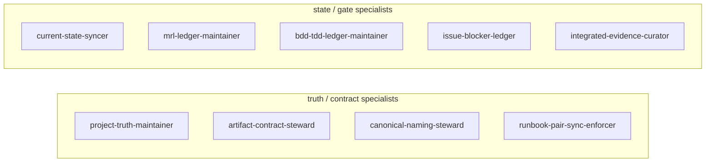

# plan-root_skill_system_overview.md skill mapping proposal
- 目的: `plan-root_skill_system_overview.md` の各章を、現行 skill 体系の俯瞰図として読みつつ、どこに不足・過大・責務重複があるかを章ごとに提案する。
- 前提: 本文書は実装一覧そのものではなく、`AGENTS.md` の refresh target 群と、project 側の実運用文書の間をつなぐ「体系図」である。
- 比較観点: `project-truth-core.md` と `realtime-compass-and-status.md` の運用負荷に対して、現行の overview が十分な manager / specialist 粒度を持つかを確認する。

## まず結論

| 観点 | 提案 |
| --- | --- |
| overview の用途 | 妥当 |
| 現行マップの不足 | truth / current / gate / contract / canonical naming が薄い |
| 大きすぎる塊 | `DocFlow`, `PlanningFlow`, `RuntimeFlow` |
| 見えにくい責務 | `project truth`, `current state`, `MRL ledger`, `BDD/TDD ledger`, `artifact contract`, `runbook pair sync` |
| 再編方針 | helper 群を増やすより、project 文書運用に直結する specialist を追加する |

## 章別対応提案

| 章 | 現状の役割 | 評価 | 提案 |
| --- | --- | --- | --- |
| 目的 | overview 文書の存在理由 | 妥当 | 現状維持 |
| 全体像 | receipt → invoke → planner → execution → response | 妥当 | 現状維持 |
| 実装済み skill 体系 | helper / specialist の関係図 | 不足あり | project 文書運用に対応する specialist を追加 |
| refresh target manager 群 | target manager の一覧 | 不足あり | target と specialist の 1対1/1対多対応を見直す |
| target manager と現行実装の対応 | どの manager が何で吸収されているか | 不足が見える章 | ここに新設 skill を反映すべき |
| 読み方 | 文書利用の補助 | 妥当 | 現状維持 |

## 現行 subgraph ごとの見立て

### Core line

| subgraph / skill | 評価 | コメント |
| --- | --- | --- |
| `skill-invoker` | やや大きい | read set、authority 判定、opportunity loop が混在 |
| `skill-planner` | 大きい | plan、phase、close、current 収束まで抱えやすい |

### IntakeHelpers

| skill | 評価 | コメント |
| --- | --- | --- |
| `rule-snapshot-reader` | 妥当 | 維持でよい |
| `authoritative-doc-scope-resolver` | 妥当 | 維持でよい |
| `rule-diff-clarifier` | 妥当 | 維持でよい |
| `write-boundary-guard` | 妥当 | 維持でよい |

### PlannerHelpers

| skill | 評価 | コメント |
| --- | --- | --- |
| `task-intent-normalizer` | 妥当 | 維持でよい |
| `task-scope-splitter` | 妥当 | 維持でよい |
| `close-condition-definer` | 妥当 | 維持でよい |
| `phase-task-orchestrator` | 妥当 | 維持でよい |

### DocFlow

| skill | 評価 | コメント |
| --- | --- | --- |
| `documentation-watchkeeper` | 抽象度が高い | 何を監視するかを分けたい |
| `doc-target-resolver` | 妥当 | 維持候補 |
| `script-doc-sync-enforcer` | 一部不足 | runbook pair 同期までは足りない |
| `test-and-evidence-recorder` | やや大きい | test と evidence は分けられる |
| `evidence-destination-resolver` | 妥当 | 維持候補 |
| `log-promotable-facts-extractor` | 妥当 | 維持候補 |

### DesignFlow

| skill | 評価 | コメント |
| --- | --- | --- |
| `design-first-script-builder` | 妥当 | 維持候補 |
| `reference-rewire-operator` | 妥当 | 維持候補 |
| `path-contract-scanner` | 不足 | scan はできても steward 不足 |
| `artifact-handoff-mapper` | 不足 | mapping 後の authoritative 維持 skill が必要 |

### RuntimeFlow

| skill | 評価 | コメント |
| --- | --- | --- |
| `runtime-operator` | 妥当 | 維持候補 |
| `runtime-structure-dependency-mapper` | 妥当 | 維持候補 |
| `runtime-bootstrap-scope-resolver` | 妥当 | 維持候補 |
| `drive-input-bootstrap-checker` | 妥当 | 維持候補 |
| `external-compute-output-keeper` | やや広い | runbook pair / evidence / output custody と近接 |

### PlanningFlow

| skill | 評価 | コメント |
| --- | --- | --- |
| `delivery-planning-keeper` | 大きすぎる | current / next action / MRL / BDD / TDD を抱えやすい |
| `frontier-research-curator` | 妥当 | 維持候補 |

### HiddenLoop

| skill | 評価 | コメント |
| --- | --- | --- |
| `skill-opportunity-scout` | 妥当 | 維持 |
| `skill-opportunity-ledger` | 妥当 | 維持 |
| `skill-opportunity-architect` | 妥当 | 維持 |
| `skill-opportunity-integrator` | 妥当 | 維持 |

## `project-truth-core.md` と照合して overview に追加すべき specialist

| 必要役割 | 理由 | 追加先候補 subgraph |
| --- | --- | --- |
| `project-truth-maintainer` | truth ownership が独立しているため | `DocFlow` または新 `TruthFlow` |
| `artifact-contract-steward` | `SessionPackage` 等の契約維持が重い | `DesignFlow` |
| `canonical-naming-steward` | canonical / alias / legacy の整理が重い | `DesignFlow` |
| `runbook-pair-sync-enforcer` | `.md/.ipynb` と source inventory の同期が重い | `DocFlow` または `RuntimeFlow` |

## `realtime-compass-and-status.md` と照合して overview に追加すべき specialist

| 必要役割 | 理由 | 追加先候補 subgraph |
| --- | --- | --- |
| `current-state-syncer` | current ownership が独立しているため | `PlanningFlow` |
| `mrl-ledger-maintainer` | MRL / mRL 管理が独立して重い | `PlanningFlow` |
| `bdd-tdd-ledger-maintainer` | BDD / TDD / acceptance / task 対応が重い | `PlanningFlow` |
| `integrated-evidence-curator` | 統合根拠欄の維持が重い | `DocFlow` |
| `issue-blocker-ledger` | 疑問点不整合一覧の管理が重い | `PlanningFlow` |

## refresh target manager 群の見直し案

| 現行 target manager | 現状の受け皿 | 問題 | 見直し案 |
| --- | --- | --- | --- |
| `document-control-manager` | `documentation-watchkeeper` など | truth / current / history を抱えすぎ | truth / current / history を分離 |
| `plan-gate-manager` | `delivery-planning-keeper` | gate と ledger が大きすぎる | `mrl-ledger-maintainer` と `bdd-tdd-ledger-maintainer` を分離 |
| `worklog-runtime-manager` | runtime 系の束 | worklog promotion と runtime が別責務 | `current-state-syncer` と runtime 系に分割 |
| `project-registry-manager` | 専用受け皿薄い | project 名管理だけでは不十分 | `canonical-naming-steward` を追加 |
| `evidence-trace-manager` | evidence recorder 系 | integrated evidence と closeout の正本性が弱い | `integrated-evidence-curator` を追加 |

## 更新後の追加候補 subgraph 案

## overview 文書としての改善提案

| 改善項目 | 提案 |
| --- | --- |
| 実装済み skill 体系 | `TruthFlow` と `StateFlow` を追加する |
| target manager 対応 | 「未対応」「部分対応」「十分対応」の列を追加する |
| 読み方 | `AGENTS.md` と project 文書のどちらから読むべきかを追記する |
| 更新ルール | 新 skill 追加時は overview も同 task で更新する、と明記する |

## 要約

| 判定軸 | 提案 |
| --- | --- |
| skill 数 | 現状は不足寄り |
| 粒度 | helper は妥当、project 文書運用系が粗い |
| 責務分離 | planner / doc / plan-gate が重い |
| 管理容易性 | 新設 specialist を足した方が上がる |
| 次にやること | `TruthFlow` と `StateFlow` を正式に足す |
