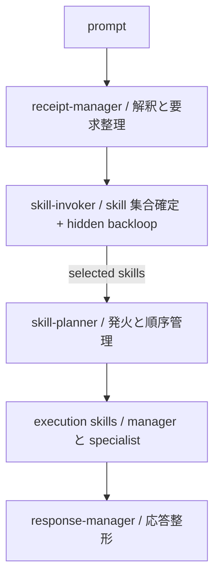
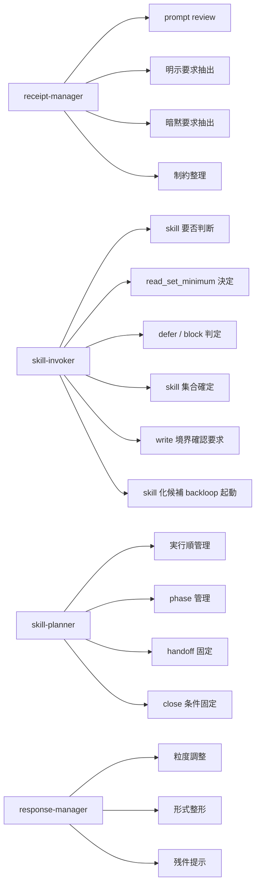
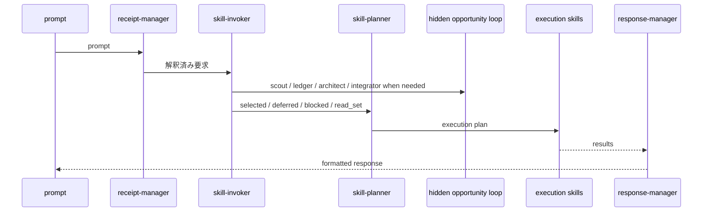

# kisaragi skill trigger system map

## 目的

- `prompt -> receipt-manager -> skill-invoker -> skill-planner -> execution -> response-manager` の主線を図で固定する。
- ownership と handoff の境界を図で読めるようにする。

## 全体構造

## ownership map

## 現行 skill の位置づけ

```mermaid
flowchart TD
    I["skill-invoker"] --> H1["rule-snapshot-reader"]
    I --> H2["authoritative-doc-scope-resolver"]
    I --> H3["rule-diff-clarifier"]

    P["skill-planner"] --> T1["task-intent-normalizer"]
    P --> T2["task-scope-splitter"]
    P --> T3["close-condition-definer"]
    P --> T4["phase-task-orchestrator"]

    I --> G1["write-boundary-guard"]
    I --> O1["skill-opportunity-scout"]
    I --> O2["skill-opportunity-ledger"]
    I --> O3["skill-opportunity-architect"]
    I --> O4["skill-opportunity-integrator"]

    P --> S1["documentation-watchkeeper"]
    P --> S2["design-first-script-builder"]
    P --> S3["reference-rewire-operator"]
    P --> S4["delivery-planning-keeper"]
    P --> S5["runtime-structure-dependency-mapper"]
    P --> S6["external-compute-output-keeper"]
    P --> S7["runtime-operator"]
    P --> S8["test-and-evidence-recorder"]
```

## 旧構成との対応

| 旧 | 新 |
| --- | --- |
| 旧単一入口の prompt review 部分 | `receipt-manager` |
| 旧単一入口の最終選定部分 | `skill-invoker` |
| `skill-planner` | `skill-planner` のまま維持 |
| 応答整形の暗黙処理 | `response-manager` |

## 標準 handoff 順

