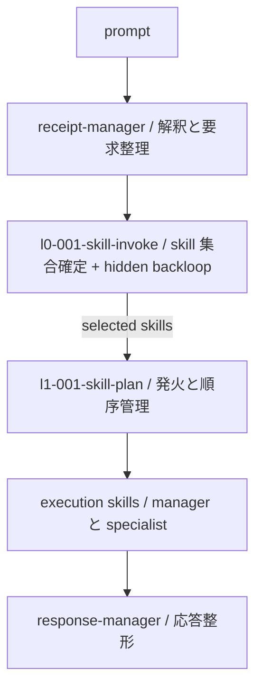
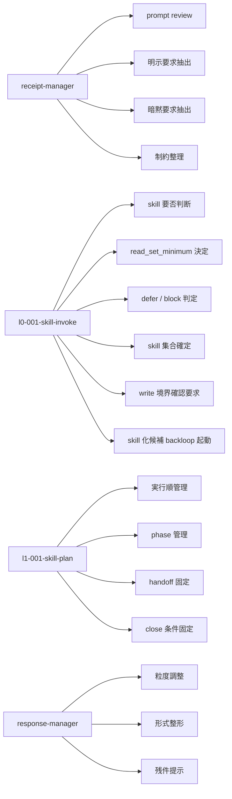
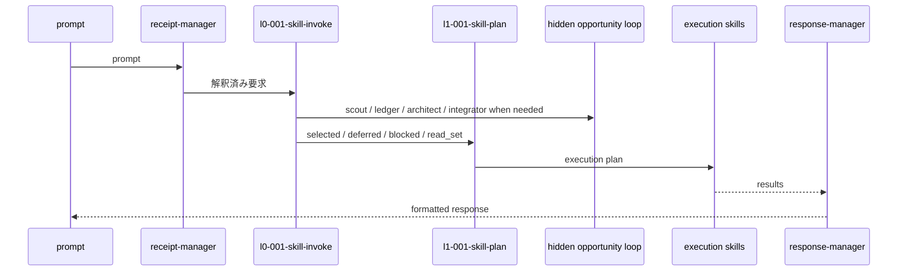

# kisaragi skill trigger system map

## 目的

- `prompt -> receipt-manager -> l0-001-skill-invoke -> l1-001-skill-plan -> execution -> response-manager` の主線を図で固定する。
- ownership と handoff の境界を図で読めるようにする。

## 全体構造

## ownership map

## 現行 skill の位置づけ

```mermaid
flowchart TD
    I["l0-001-skill-invoke"] --> H1["l1-006-rule-snapshot-read"]
    I --> H2["l1-007-authoritative-doc-scope-resolve"]
    I --> H3["l1-008-rule-diff-clarify"]

    P["l1-001-skill-plan"] --> T1["l1-003-task-intent-normalize"]
    P --> T2["l1-004-task-scope-split"]
    P --> T3["l1-005-close-condition-define"]
    P --> T4["l1-002-phase-task-orchestrate"]

    I --> G1["l1-009-write-boundary-guard"]
    I --> O1["lt-002-skill-opportunity-scout"]
    I --> O2["lt-003-skill-opportunity-ledger"]
    I --> O3["lt-004-skill-opportunity-architect"]
    I --> O4["lt-005-skill-opportunity-integrate"]

    P --> S1["l2a-005-documentation-watchkeep"]
    P --> S2["l2a-001-design-first-script-build"]
    P --> S3["l2a-002-reference-rewire-operate"]
    P --> S4["l2a-003-delivery-plan-keep"]
    P --> S5["l2b-005-runtime-structure-dependency-map"]
    P --> S6["l2a-008-external-compute-output-keep"]
    P --> S7["l2a-004-runtime-operate"]
    P --> S8["l2a-009-test-evidence-record"]
```

## 旧構成との対応

| 旧 | 新 |
| --- | --- |
| 旧単一入口の prompt review 部分 | `receipt-manager` |
| 旧単一入口の最終選定部分 | `l0-001-skill-invoke` |
| `l1-001-skill-plan` | `l1-001-skill-plan` のまま維持 |
| 応答整形の暗黙処理 | `response-manager` |

## 標準 handoff 順

