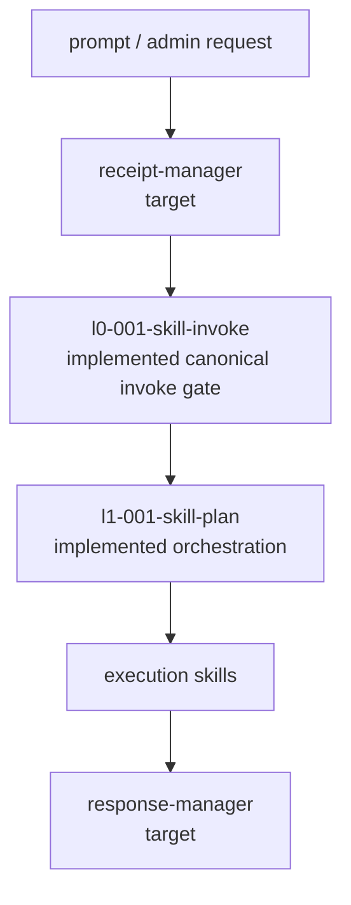
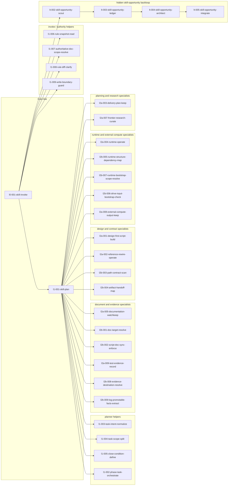
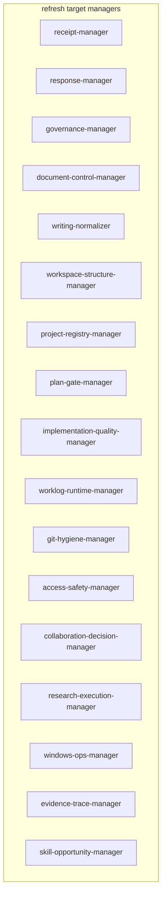
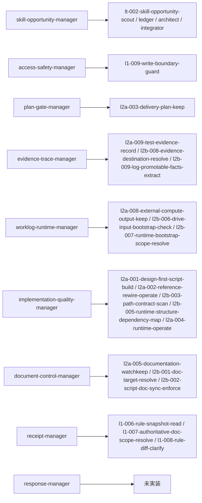

# root skill system overview

## 目的

- `root-skills/` 配下の skill 体系を、主線、補助 skill、実行 specialist、hidden backloop、refresh target manager 群の関係で俯瞰できるようにする。
- `agents.md` と `root_skill_trigger_system_map.md` の読解を補助する一覧図として使う。

## 全体像

## 実装済み skill 体系

## refresh target manager 群

## target manager と現行実装の対応

## 読み方

- `l0-001-skill-invoke` が表向きの正本入口であり、`l1-001-skill-plan` へ visible execution set を handoff する。
- `skill-opportunity-*` family は hidden backloop として動き、候補抽出、台帳追記、分類、admin `Go` 後反映を分担する。
- refresh target manager 群は設計上の target であり、現時点では specialist 群の束として段階的に吸収・統合していく前提で扱う。
